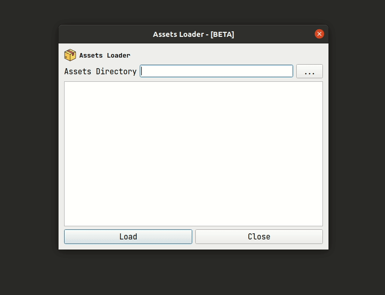
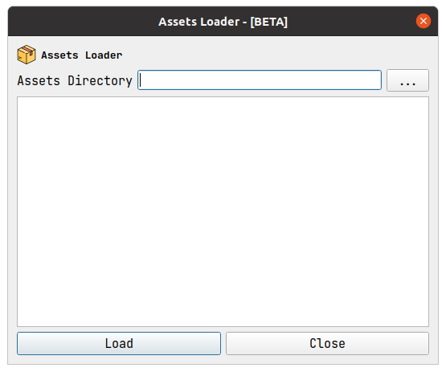
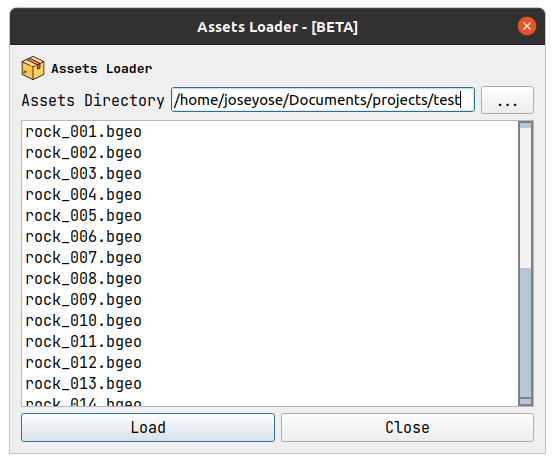

# AssetLoader
---
AssetLoader is an application that loads 3D objects, ie: `obj`, `fbx`, `abc`, `bgeo`, into [GPlay](https://www.sidefx.com/docs/houdini/ref/utils/gplay.html) which is a viewport similar to the one found in [Houdini](https://www.sidefx.com/) for quick previewing. 

You can rotate, tumble, zoom and even render the viewed geometry. 

There is no limit for how many instances can be loaded up, but keep in mind your own system specs.

## Requirements:

- `python == 3.8`
- `pyqt5 == 5.15.4`
- `houdini == 18.5`

## Setup 
Download and install [Python3.8](https://www.python.org/downloads/)

Download and install [Houdini Apprentice](https://www.sidefx.com/download/)

Make sure both python and houdini are in your `PATH` environment variable.

Run the following commands:
```
# Install pyqt5
pip3 install pyqt5==5.15.4

# Run the application
python3 ./assetviewer.py
```
## Usage
`python3 ./assetViewer.py`



## Screenshots



## License
---
See the [LICENSE](https://github.com/joseyose/assetLoader/blob/main/LICENSE) file for license rights and limitations (MIT).